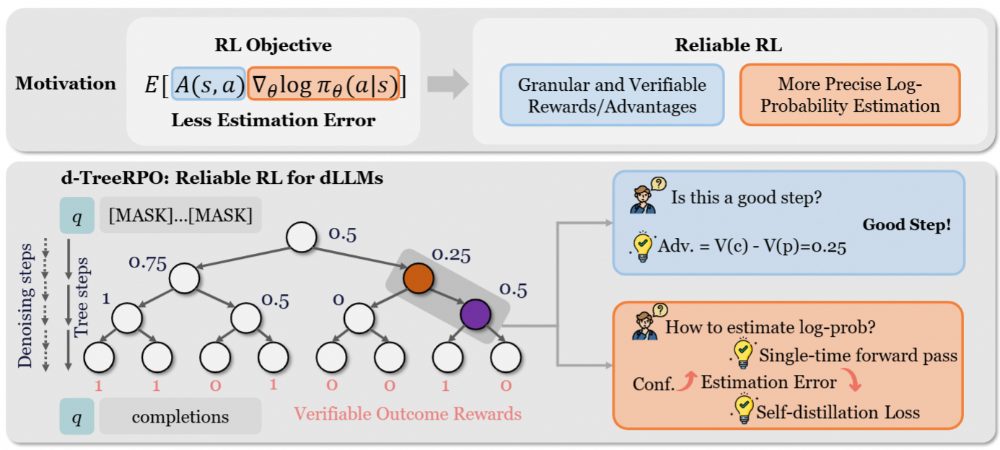
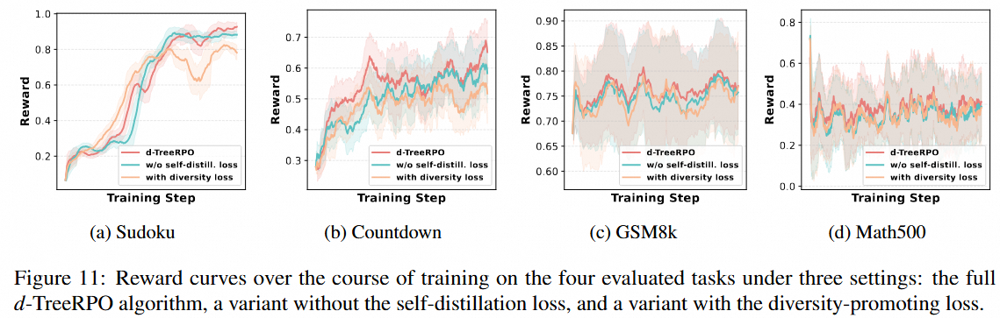
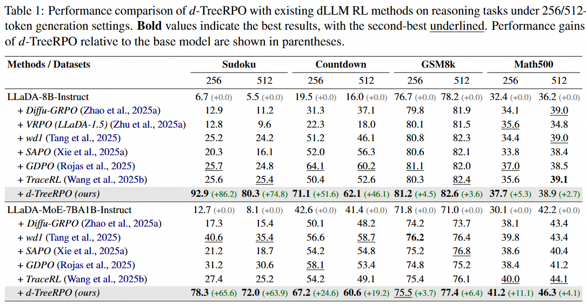

<div align="center">
<h2>d-TreeRPO: Towards More Reliable Policy Optimization for Diffusion Language Models</h2>

[](https://arxiv.org/abs/2512.09675)
[](https://huggingface.co/collections/Leyiii/dtreerpo-checkpoints)

</div>

<p align="center">

</p>

## Introduction
d-TreeRPO is a reliable reinforcement learning framework for diffusion language models (dLLMs). It improves policy optimization by:
- organizing rollouts into a tree structure and propagating verifiable outcome rewards bottom-up to obtain **fine-grained step-wise advantages**
- introducing a time-scheduled self-distillation loss that gradually **increases model determinism in later training**, enabling **more accurate transition probability estimation** for any-order decoding. 

d-TreeRPO achieves strong gains on reasoning benchmarks such as Sudoku, Countdown, GSM8K, and Math500.

## Environment Setup
```bash
conda env create -f env.yml
conda activate dtreerpo
```

## Training
We provide several training scripts for LLaDA-8B-Instruct and LLaDA-MoE-7BA1B-Instruct in `dtreerpo/`. For example, to train LLaDA-8B-Instruct on Sudoku task, run
```bash
cd dtreerpo
bash run_llada_sudoku_dtreerpo.sh
```
Note: following previous works ([Diffu-GRPO](https://arxiv.org/abs/2504.12216), [wd1](https://arxiv.org/abs/2507.08838)), we use lora training.

Below are the reward curves for d-TreeRPO on different tasks (LLaDA-8B-Instruct), with and without self-distillation loss, as well as a variant with diversity-promoting loss (see the paper for details):

<p align="center">

</p>


## Evaluation
We provide several evaluation scripts for LLaDA-8B-Instruct and LLaDA-MoE-7BA1B-Instruct in `eval/`. For example, to evaluate checkpoints using LLaDA-8B-Instruct as the base model, run:
```bash
cd eval
bash eval_llada_dtreerpo.sh
```
This script will load all saved LoRA adapters from the specified directory, merge (attach) each adapter into the base model, and then run evaluation.

After generating the results, run the following script to acquire the final scores:
```bash
python parse_and_get_acc.py
```

## Performance Comparison
Below are the performance comparison with previous works: d-TreeRPO outperform several baselines under most settings, especially on the planning tasks such as Sudoku and Countdown.

<p align="center">

</p>

<!-- ## Checkpoints
To ensure reproducibility, we provide checkpoints for LLaDA-8B-Instruct and LLaDA-MoE-7BA1B-Instruct in [HuggingFace Repo](). These are trained **Lora adapters** for different tasks.  -->

## Acknowledgements
This repository is built upon the [Diffu-GRPO](https://github.com/HazyResearch/diffu-grpo) and [wd1](https://github.com/HazyResearch/wd1) repositories.

## Citation
```
@article{pan2025d,
    title={d-TreeRPO: Towards More Reliable Policy Optimization for Diffusion Language Models},
    author={Pan, Leyi and Tao, Shuchang and Zhai, Yunpeng and Fu, Zheyu and Fang, Liancheng and He, Minghua and Zhang, Lingzhe and Liu, Zhaoyang and Ding, Bolin and Liu, Aiwei and others},
    journal={arXiv preprint arXiv:2512.09675},
    year={2025}
}
```

